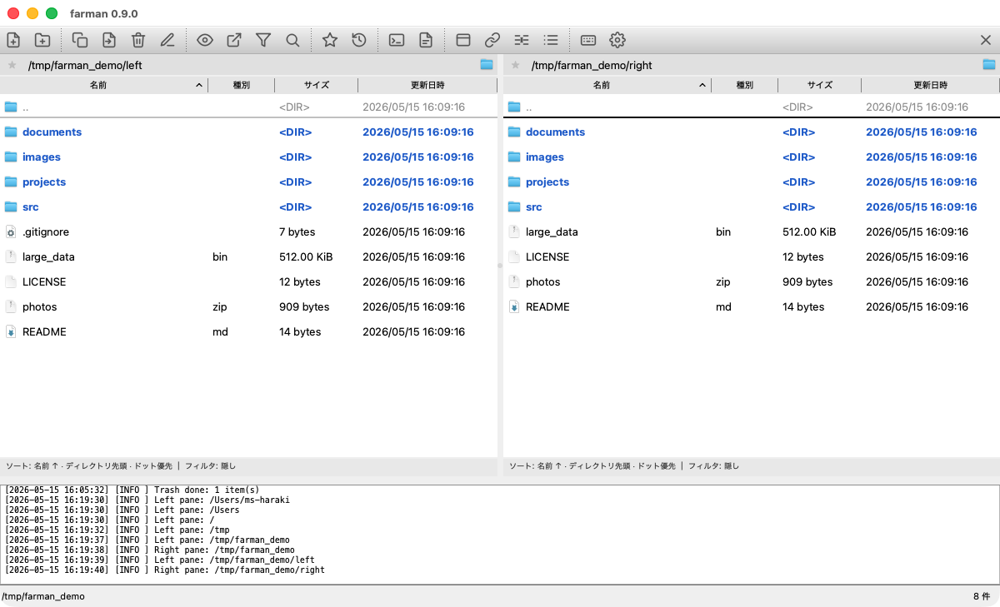
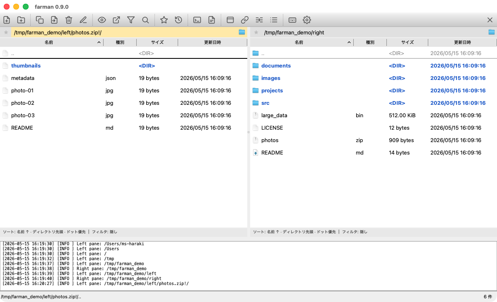
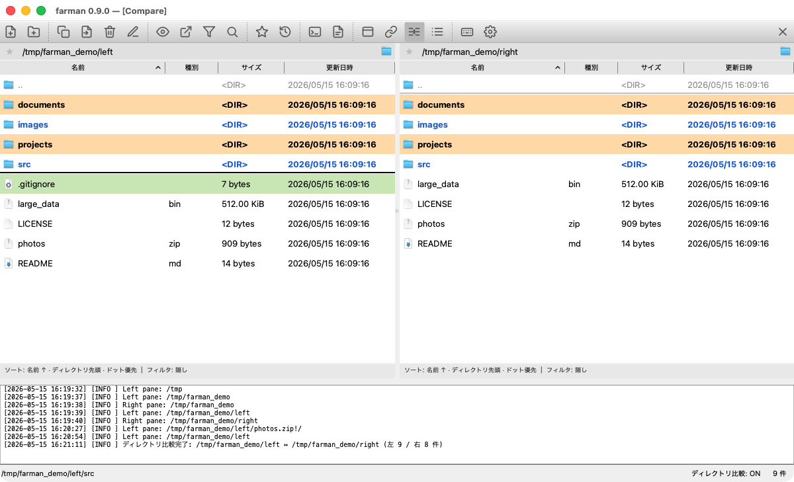
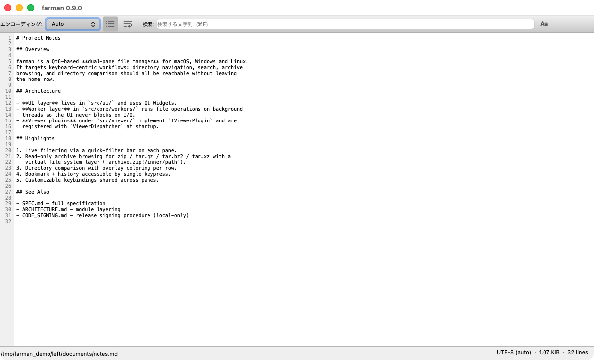
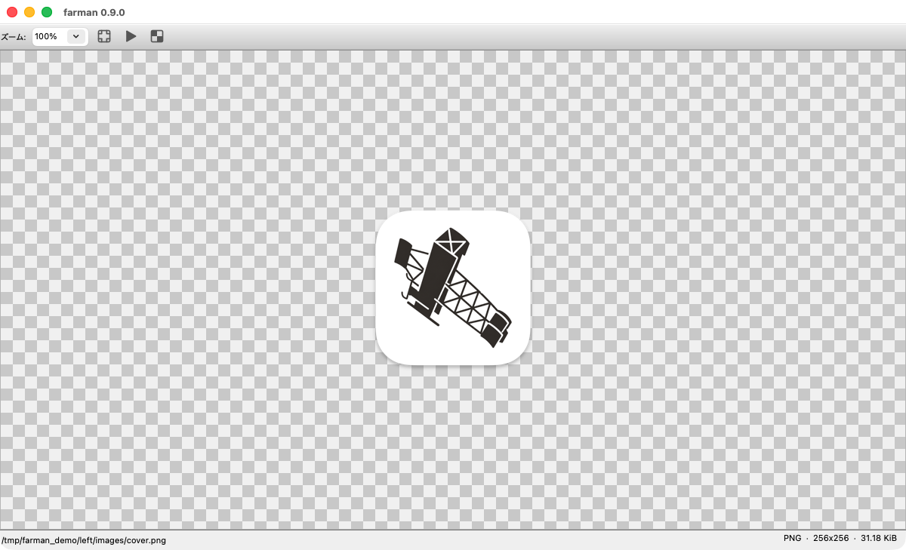
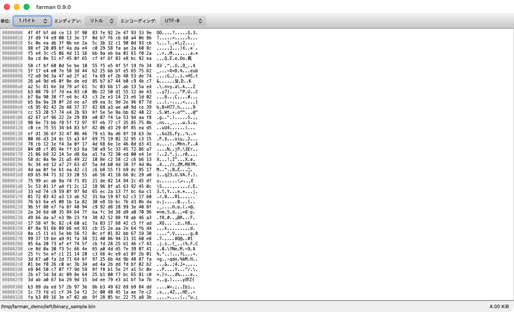
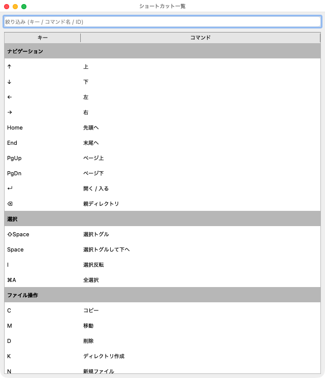
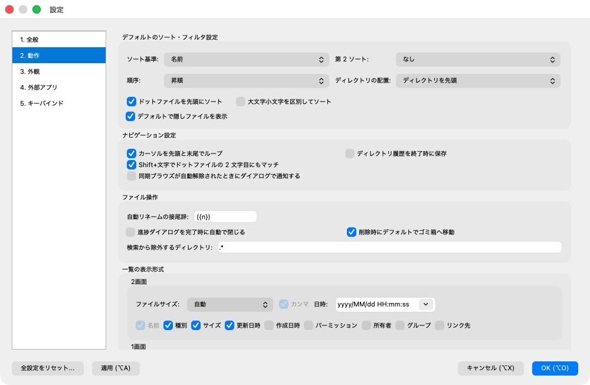
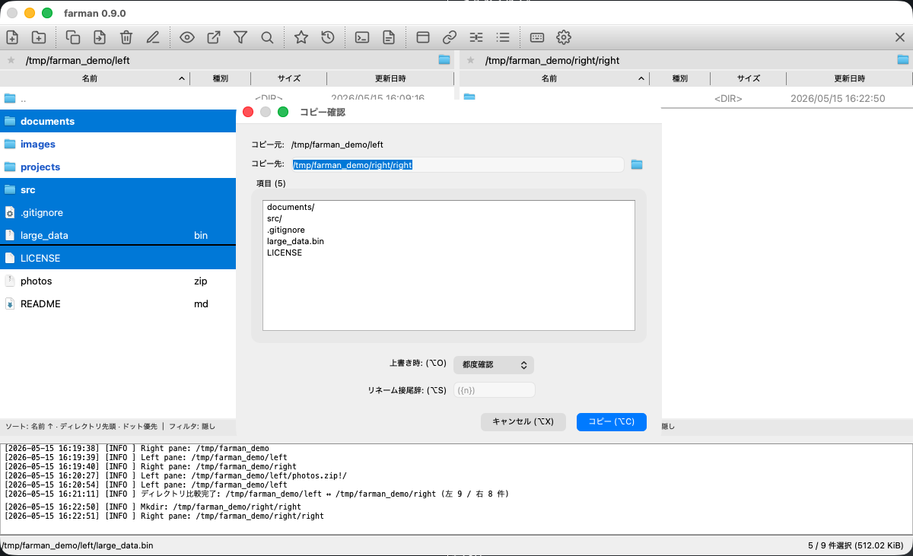

# farman

[](https://github.com/ms-haraki/farman/actions/workflows/build.yml)
[](LICENSE)

Qt6 / C++20 製のクロスプラットフォーム 2 画面ファイラ。
キーボードのみで全ての操作を完結できる、使い勝手の良いファイラを目指してます。

## 主な機能

- **2 ペイン UI** + 任意のシングルペイン切替、左右ペイン間でのコピー / 移動 / 同期
- **キー駆動**操作: `c`/`m`/`k`/`d`/`r`/`n`/`a`/`f`/`p`/`u` 等の単一キーで主要操作
- **ファイル操作**: コピー / 移動 / 削除 (ゴミ箱 or 完全削除) / リネーム /
  **一括リネーム** (テンプレート + 連番 + 正規表現置換 + プレビュー)
- **アーカイブ**: zip / tar / tar.gz / tar.bz2 / tar.xz の作成・展開 (libarchive)
- **検索**: バックグラウンド再帰検索、結果からの直接ジャンプ
- **ブックマーク**, **ディレクトリ履歴** (永続化可)
- **ビュアー**: テキスト (エンコード自動判定 / 行番号 / ワードラップ) / 画像
  (ズーム / Fit to Window / 透明背景 Checker / アニメーション GIF・WebP) /
  バイナリ (16 進ダンプ + アドレス列・文字列列カラーリング)
- **任意ビュアーで開く** (Ctrl+Enter) / **OS 既定アプリで実行** (Shift+Enter)
- **ログペイン** (日次ローテーション + 保持日数設定)
- **アドレスバー / カーソル / カテゴリ別ファイル色 / 行高** などの外観カスタマイズ
- **キーバインドの完全カスタマイズ** + デフォルトリセット
- **国際化**: 英語 / 日本語 (Auto は OS 設定に追従)
- **外部変更の自動反映**: Finder などからファイルを増減すると即座に追随

## スクリーンショット

### メイン 2 ペイン

ツールバー + 左右ペイン + ログペインの基本レイアウト。



### アーカイブブラウジング

`.zip` / `.tar.gz` などのアーカイブを Enter で開き、仮想 FS (`archive.zip!/inner/`)
として閲覧。中の単一ファイルだけビュアーで開いたり、選択コピーで取り出せる。



### ディレクトリ比較

左右ペインで比較対象を開いて `=` で発動。差分のあるファイル / このペインのみに
存在するファイルを行ごとに色分けハイライト。



### ビュアー

テキスト (エンコード自動判定 + 行番号) / 画像 (ズーム + Fit) / バイナリ
(16 進ダンプ + アドレス列・文字列列カラーリング) の 3 種類が組み込み。







### 共通ダイアログ

ショートカット一覧 (`?`) / 設定 / コピー・移動の確認ダイアログ。
すべて Tab フォーカス + Alt+key で完結。







## 動作環境

- **macOS** 12 (Monterey) 以降 / Apple Silicon (M1/M2/M3/M4)
  - 配布 DMG は arm64 専用。Intel Mac で動かしたい場合はリポジトリを
    clone して各自ローカルビルドで対応 (CMakeLists.txt は Intel
    Homebrew prefix `/usr/local` も検索する)。
  - CI で Universal Binary を生成する案は GitHub Actions の macos-13
    runner が実質利用不可となり保留 (SPEC.md バックログ参照)
- **Windows** 10 / 11 (x64)
- **Linux** Qt 6 が動く X11 / Wayland 環境 (Ubuntu 22.04 以降で動作確認)

## バイナリの入手

正式リリース前のため、配布バイナリはまだ提供していません。
最新の開発ビルドは GitHub Actions の成果物から取得できます:

<https://github.com/ms-haraki/farman/actions/workflows/build.yml>

該当ワークフローの run を選んで、Artifacts からプラットフォーム別の zip を
ダウンロードしてください:

| Artifact 名 | 中身 |
|---|---|
| `farman-macos` | `.dmg` (Qt frameworks 同梱) |
| `farman-windows` | `farman.exe` + Qt DLL + libarchive / uchardet 関連 DLL |
| `farman-linux` | `farman-x86_64.AppImage` |

> **macOS**: 未署名アプリのため、初回は Gatekeeper による警告が出ます:
>
> - 警告が「**右クリック → Open**」で開けるタイプならそれで OK
> - 「**壊れているため開けません**」と出る場合は quarantine 属性のせい:
>   ```bash
>   xattr -cr /Applications/farman.app
>   ```
>   を実行してから再度起動 (これは未署名アプリ全般の対処法。
>   Apple Developer ID 署名は v1.0 以降に対応予定)。
>
> **Windows**: SmartScreen が警告を出す可能性があります。「詳細情報」→
> 「実行」で起動してください (未署名のため)。

## ソースからのビルド

### macOS

前提パッケージ (Homebrew):

```bash
brew install qt libarchive uchardet pkg-config
```

ビルド:

```bash
cmake -B build -DCMAKE_PREFIX_PATH=/opt/homebrew/opt/qt
cmake --build build
```

起動:

```bash
open ./build/farman.app
# 開発時にデバッグログを Terminal で見たいときはバンドル内の実行ファイルを直接:
./build/farman.app/Contents/MacOS/farman
```

配布用 `.dmg` の作成:

```bash
macdeployqt build/farman.app -dmg
# build/farman.dmg が生成される
```

### Linux (Debian / Ubuntu)

前提パッケージ:

```bash
sudo apt install -y \
  qt6-base-dev qt6-tools-dev qt6-5compat-dev \
  libarchive-dev libuchardet-dev \
  cmake pkg-config libgl1-mesa-dev libxkbcommon-dev
```

ビルド:

```bash
cmake -B build
cmake --build build
```

起動:

```bash
./build/farman
```

配布用 AppImage の作成 (linuxdeploy 利用):

```bash
# 初回のみ
wget https://github.com/linuxdeploy/linuxdeploy/releases/download/continuous/linuxdeploy-x86_64.AppImage
wget https://github.com/linuxdeploy/linuxdeploy-plugin-qt/releases/download/continuous/linuxdeploy-plugin-qt-x86_64.AppImage
chmod +x linuxdeploy*.AppImage

# 生成
./linuxdeploy-x86_64.AppImage \
  --appdir AppDir \
  -e build/farman \
  -i images/icon-256.png \
  -d linux/farman.desktop \
  --plugin qt \
  --output appimage
```

### Windows

前提:

1. **Visual Studio 2022** をインストール (C++ によるデスクトップ開発ワークロード)
2. **Qt 6.10 以降** を [Qt Online Installer](https://www.qt.io/download-qt-installer-oss) からインストール
   - コンポーネント: **MSVC 2022 64-bit** + **Qt 5 Compatibility Module** にチェック
   - 例: `C:\Qt\6.10.3\msvc2022_64\`
3. **vcpkg** で libarchive / uchardet を取得:
   ```powershell
   git clone https://github.com/microsoft/vcpkg C:\vcpkg
   cd C:\vcpkg
   .\bootstrap-vcpkg.bat
   .\vcpkg integrate install
   .\vcpkg install libarchive:x64-windows uchardet:x64-windows
   ```

ビルド (Developer Command Prompt for VS 2022 から):

```powershell
cmake -B build ^
  -DCMAKE_PREFIX_PATH="C:\Qt\6.10.3\msvc2022_64" ^
  -DCMAKE_TOOLCHAIN_FILE="C:\vcpkg\scripts\buildsystems\vcpkg.cmake"
cmake --build build --config Release
```

起動:

```powershell
build\Release\farman.exe
```

配布用パッケージ (Qt DLL + 依存 DLL を実行ファイル横に同梱):

```powershell
windeployqt --release build\Release\farman.exe
copy C:\vcpkg\installed\x64-windows\bin\*.dll build\Release\
# build\Release\ ディレクトリ全体を zip して配布
```

### クリーンビルド (全プラットフォーム共通)

```bash
rm -rf build         # Windows: rmdir /s /q build
# 上記の cmake コマンドを再実行
```

## CI / リリース

- `.github/workflows/build.yml` — **3 OS × push 毎** の自動ビルド検証。
  成果物は Actions の artifact として 14 日保存される (動作確認用)。
- `.github/workflows/release.yml` — タグ push をトリガに 3 OS の配布
  パッケージ (DMG / AppImage / zip) をビルドし、GitHub Releases に **draft**
  として公開する。本人が GitHub UI で内容を確認してから "Publish release"
  を押すまで世に出ない運用。

### リリース手順

```bash
# 1. ローカルでバージョンタグを切る (vMAJOR.MINOR.PATCH 形式)
git tag v1.0.0
git push origin v1.0.0

# 2. GitHub の Actions タブで "Release" ワークフローの進行を確認
#    3 OS 並列ビルド → 30〜40 分程度

# 3. 完了後 Releases ページに draft が出来る
#    https://github.com/<owner>/farman/releases
#    - farman-v1.0.0-macos-arm64.dmg
#    - farman-v1.0.0-linux-x86_64.AppImage
#    - farman-v1.0.0-windows-x64.zip

# 4. 動作確認 → "Edit" → "Publish release" で世に出る
```

事前テストしたい場合は `v0.0.0-test` のような prerelease タグで試すと
よい (`-` を含むタグは自動的に prerelease 扱い)。draft なので不要なら
削除して安全にやり直せる。タグも `git tag -d v0.0.0-test &&
git push --delete origin v0.0.0-test` で消せる。

コード署名は未対応 (macOS は ad-hoc 署名のみ)。ユーザーは macOS なら
「右クリック → 開く」、Windows は SmartScreen "詳細情報 → 実行" で
起動する運用。配布数が増えたら Developer ID / Authenticode を導入予定。

リリースノートは `release.yml` が GitHub の auto-generated notes として
コミット / PR の差分を自動収集する。それとは別に、ユーザー視点の主要変更
点は [CHANGELOG.md](CHANGELOG.md) に Keep a Changelog 形式で記録している。

## デフォルトキーバインド (抜粋)

| キー | 動作 |
|---|---|
| `↑` / `↓` / `Home` / `End` / `PageUp` / `PageDown` | カーソル移動 |
| `←` / `→` | ペイン端で親ディレクトリ / 反対ペインへ |
| `Tab` | ペイン切替 |
| `Enter` | ディレクトリへ入る / ビュアーで開く |
| `Backspace` | 親ディレクトリへ |
| `Space` / `Shift+Space` | 選択トグル (移動あり / なし) |
| `Shift+文字` | 頭文字でカーソルジャンプ (ドットファイルは 2 文字目もマッチ) |
| `c`/`m`/`d`/`r`/`k`/`n` | コピー / 移動 / 削除 / リネーム / 新規ディレクトリ / 新規ファイル |
| `Ctrl+R` | 一括リネーム |
| `Ctrl+C` | カーソル行のパスをクリップボードへコピー |
| `f` | ファイル検索 |
| `p` / `u` | アーカイブ作成 / 展開 |
| `v` | ビュアーで開く |
| `Ctrl+Enter` | 任意のビュアーで開く |
| `Shift+Enter` | OS 既定アプリで実行 |
| `b` / `Ctrl+B` | ブックマーク登録/解除 / 一覧 |
| `h` | ディレクトリ履歴 |
| `s` | ソート・フィルタ設定 (このディレクトリ専用にも保存可) |
| `Ctrl+L` | ログペイン表示切替 |
| `Ctrl+Right` / `Ctrl+Left` | ペインのディレクトリを反対側に同期 |
| `Ctrl+,` | 設定 |
| `Ctrl+Q` | 終了 |

すべて Settings → Keybindings タブで変更可能。

## 設定の保存場所

| OS | パス |
|---|---|
| macOS | `~/Library/Preferences/Farman/farman/settings.json` |
| Linux | `~/.config/Farman/farman/settings.json` |
| Windows | `%APPDATA%\Farman\farman\settings.json` |

ログ既定値: 同ディレクトリ下 `farman-YYYY-MM-DD.log` (Settings から変更可)

## ドキュメント

- [SPEC.md](SPEC.md) — 機能仕様書
- [ARCHITECTURE.md](ARCHITECTURE.md) — コード構成
- [CLAUDE.md](CLAUDE.md) — Claude Code 用のガイダンス

## 翻訳

`translations/farman_ja.ts` が日本語訳。Qt Linguist で開いて編集可能:

| OS | Linguist のパス例 |
|---|---|
| macOS | `/opt/homebrew/opt/qt/bin/Linguist` |
| Linux | `/usr/bin/linguist6` (apt 版) |
| Windows | `C:\Qt\6.10.3\msvc2022_64\bin\linguist.exe` |

`tr()` 文字列の抽出 (.ts への反映):

```bash
cmake --build build --target update_translations
```

## ライセンス

[MIT License](LICENSE) — Copyright (c) Mashsoft Inc.

## 依存ライブラリ / 謝辞

farman は以下のオープンソースソフトウェアを利用しています。各ライブラリのライセンスは
それぞれの上流に従います。

| ライブラリ | 用途 | ライセンス |
|---|---|---|
| [Qt 6](https://www.qt.io/) (Core / Widgets / Core5Compat / LinguistTools) | UI フレームワーク | LGPL v3 |
| [libarchive](https://www.libarchive.org/) | アーカイブ作成・展開 (zip / tar / gz / bz2 / xz) | New BSD |
| [uchardet](https://www.freedesktop.org/wiki/Software/uchardet/) | テキストエンコード自動判定 | MPL 1.1 (Mozilla Public License 1.1) |

すべて動的リンクで利用しています。バイナリ配布版を作る際は各ライブラリのライセンス
通知も同梱します。
